<div align="center">

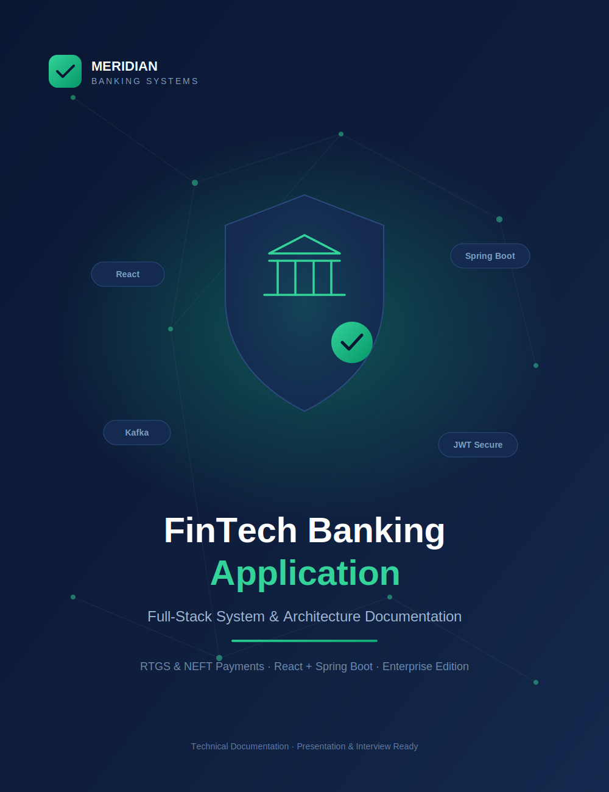

# 💳 FinTech Banking Application

### A full-stack online banking system with RTGS & NEFT payments

[]()
[]()
[]()
[]()
[]()

</div>

---

## 📖 Project Overview

The **FinTech Banking Application** is a full-stack online banking system. The **frontend** (React) is what users interact with, while the **backend** (Spring Boot) handles the money, security, and data. Together they support secure login and **RTGS** and **NEFT** money transfers.

The system demonstrates how real banking platforms move money safely — using secure authentication, validation, fraud checks, transactional integrity, and a full audit trail.

---

## ✨ Features

- 🔐 **Secure authentication** — JWT-based login and signup with password hashing
- 🏦 **Account management** — open accounts, view balances and status
- 👥 **Beneficiary management** — add, validate, and remove saved payees
- ⚡ **RTGS transfers** — instant, high-value settlement with a minimum-amount rule
- 📦 **NEFT transfers** — batched, scheduled settlement via a background worker
- 📊 **Transaction history** — searchable, paginated records with status tracking
- 🛡️ **Fraud checks** — daily transfer limits and duplicate-transaction detection
- 🔁 **Idempotency** — safe retries that never move money twice
- 📝 **Audit logging** — a record of important API activity
- 🔔 **Notifications** — success/failure messages (event-based or simulated)

---

## 🛠️ Tech Stack

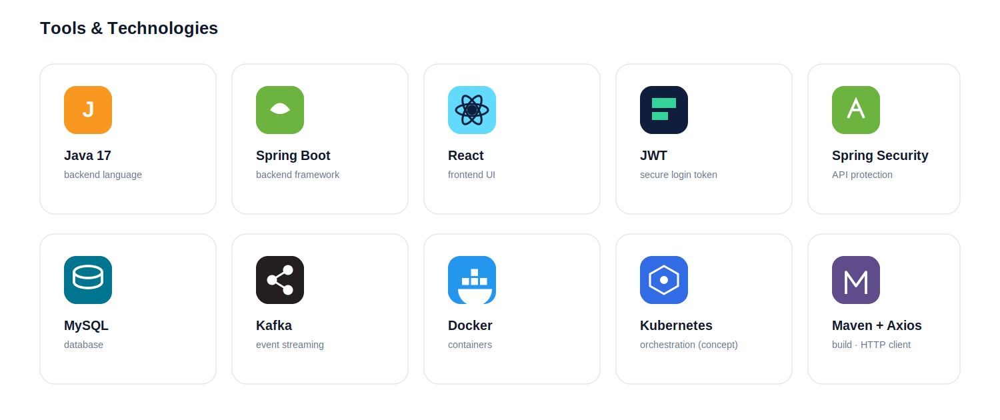

| Layer | Technology | Purpose |
|-------|------------|---------|
| **Frontend** | React + Axios | User interface and API calls |
| **Backend** | Java 17 + Spring Boot | REST APIs and business logic |
| **Security** | JWT + Spring Security | Secure login tokens and API protection |
| **Database** | MySQL (H2 for local runs) | Persistent data storage |
| **Build** | Maven | Builds the backend and manages libraries |
| **Optional / Conceptual** | Kafka, Redis, Docker, Kubernetes | Event streaming, caching, containers, scaling |

> **Scope note:** Kafka, Redis, Docker, and Kubernetes are optional or conceptual. The application runs fully without them using H2 (or MySQL) and simulated notifications.

---

## 🏗️ Architecture

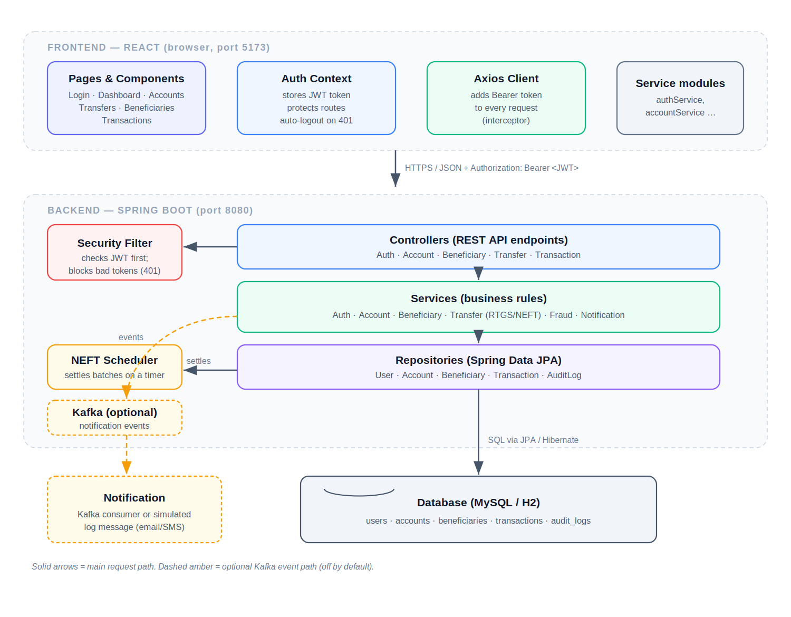

A request flows top to bottom: the React screen calls Axios, which adds the login token and sends it to Spring Boot. The **security filter** checks the token, the **controller** receives it, the **service** applies the rules, and the **repository** reads or writes the database. The dashed amber path is the optional Kafka notification flow.

### Backend Request Lifecycle

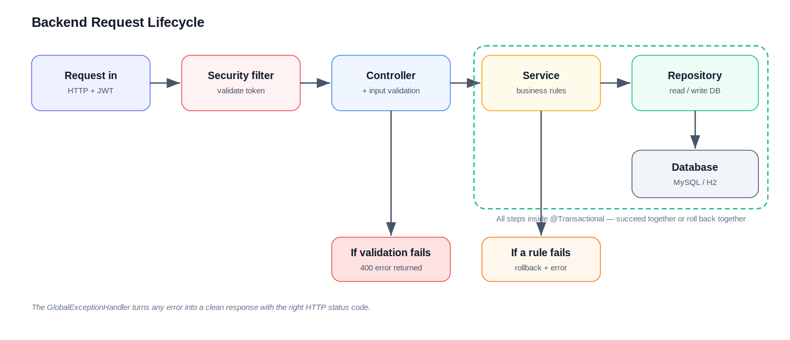

The request passes through the security filter, controller (which validates input), service (which applies business rules), and repository (which talks to the database). The whole flow runs inside **one transaction** — if any step fails, all changes are undone and the error handler returns a clean response.

### API Communication

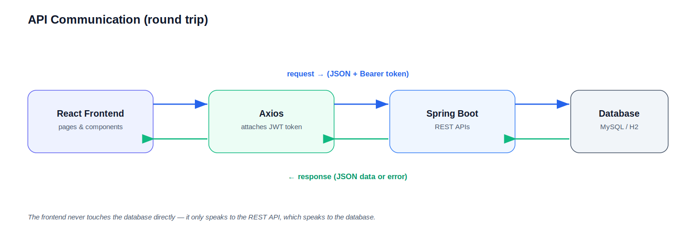

The frontend sends a request (with the token) through Axios to the REST API, which talks to the database and sends back a response. The frontend **never touches the database directly**.

### Project Folder Structure

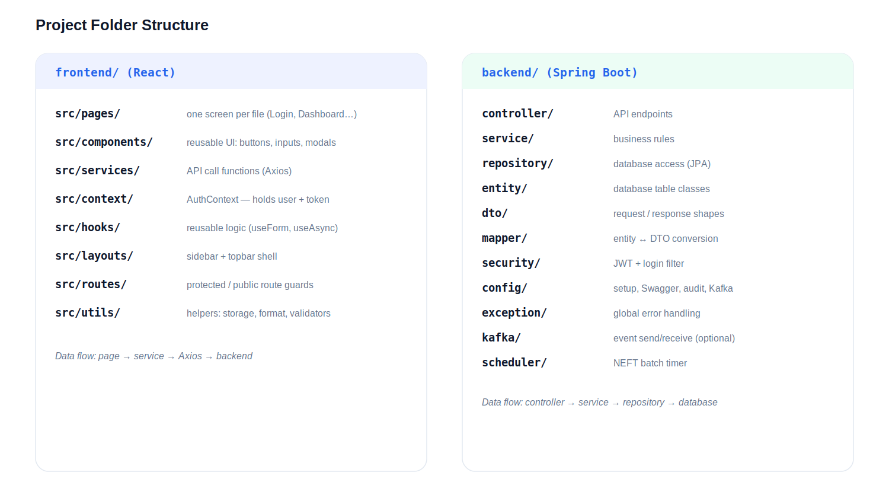

Each folder has one clear job. The frontend flows `page → service → Axios → backend`; the backend flows `controller → service → repository → database`.

---

## 🔐 JWT Authentication

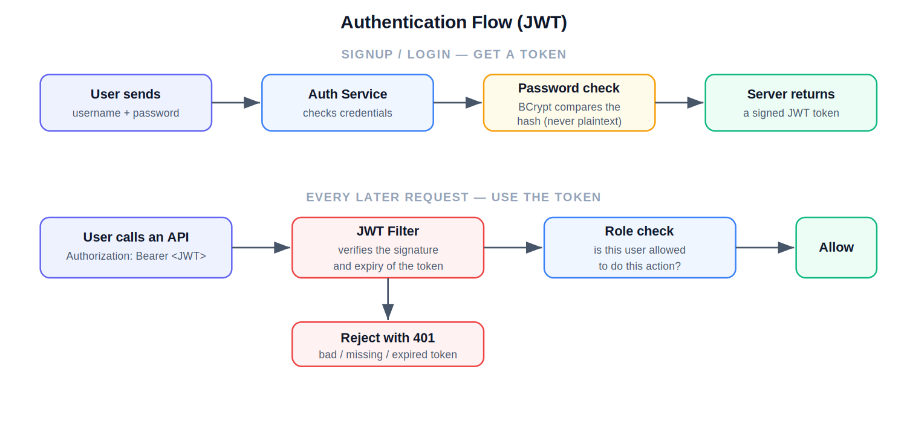

- **What JWT is** — a signed digital pass the server gives you after login.
- **Why it is used** — so the server can trust who you are on every request without storing sessions.
- **How it works** — you send the token with each request; the server checks its signature and lets valid ones through, rejecting the rest with `401`.

---

## 🔄 Workflow

### RTGS — Instant Settlement

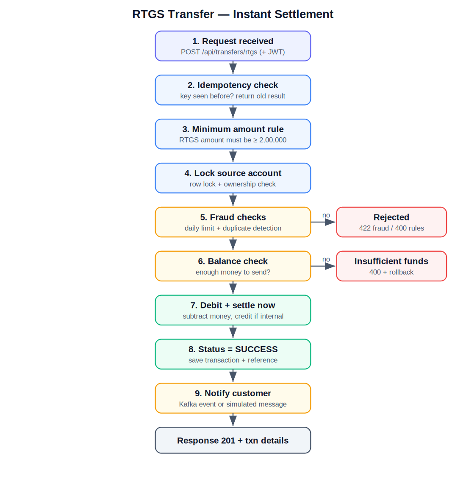

RTGS is for high-value transfers and settles instantly. After the request passes the idempotency check, minimum-amount rule, account lock, fraud checks, and balance check, the money is debited and settled immediately, the status becomes **SUCCESS**, and a notification is sent.

### NEFT — Batch Settlement

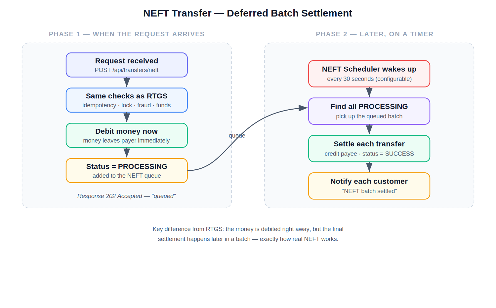

NEFT debits the money right away but marks the transfer as **PROCESSING** (queued). A scheduler runs on a timer, picks up all queued NEFT transfers, settles them in a batch, marks them **SUCCESS**, and notifies each customer — exactly how real NEFT works.

### End-to-End Connected Workflow

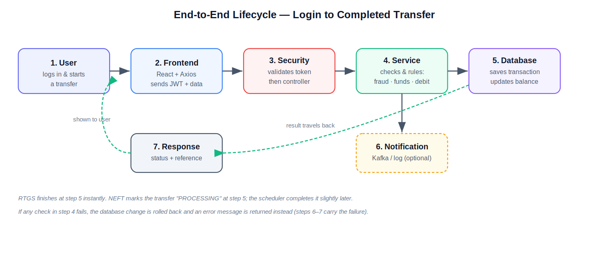

This ties everything together. The user acts on the React screen; Axios sends the request with the token; security validates it; the service runs the checks and moves the money; the database is updated; an optional notification is sent; and the result travels back to the screen. RTGS finishes instantly; NEFT completes shortly after via the scheduler. If any check fails, the change is rolled back and an error is returned instead.

---

## 🗄️ Database Design

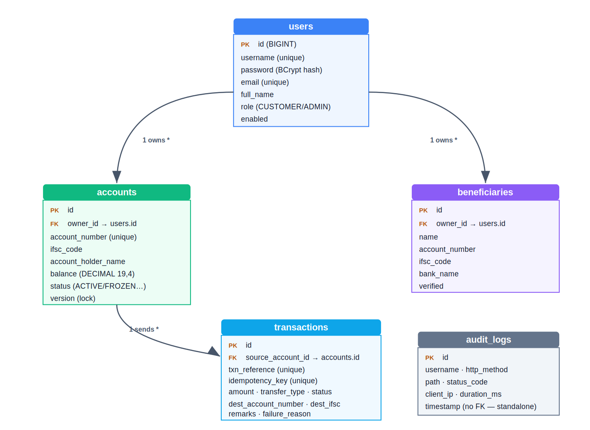

Five tables store everything:

| Table | Purpose | Key relationship |
|-------|---------|------------------|
| `users` | Login details, hashed password, role | owns many accounts & beneficiaries |
| `accounts` | Balance, account number, status | belongs to one user; sends many transactions |
| `beneficiaries` | Saved payees | belongs to one user |
| `transactions` | Every money movement with status & reference | belongs to one source account |
| `audit_logs` | Security trail of API activity | standalone |

> **Note:** Notifications are sent as live events / log messages, not stored in a table, so there is no notifications table in the current database.

---

## ⚠️ Exception Handling

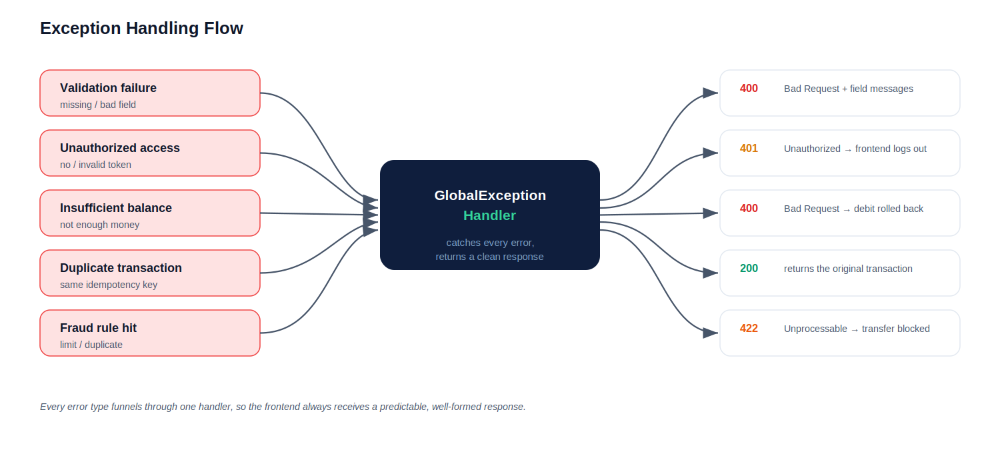

Every kind of error — validation, unauthorized, insufficient balance, duplicate, or fraud — funnels through one **GlobalExceptionHandler**, which returns a clean response with the correct HTTP status code. This keeps error handling consistent and predictable for the frontend.

| Error | HTTP status | Handling |
|-------|-------------|----------|
| Validation failure | `400` | Returns field-level messages |
| Unauthorized / invalid token | `401` | Frontend logs the user out |
| Insufficient balance | `400` | Debit is rolled back |
| Duplicate transaction | `200` | Returns the original transaction (no double charge) |
| Fraud rule hit | `422` | Transfer is blocked |

---

## 🖥️ Screenshots

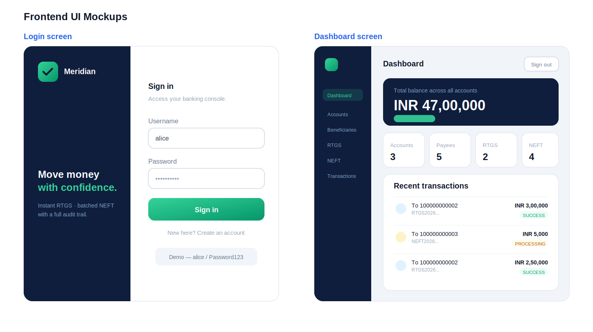

- **Login screen** — takes a username and password and returns a secure token.
- **Dashboard** — shows total balance, quick stats, and recent transactions pulled live from the backend.

**Main frontend flows**

- **Login flow** — enter credentials → backend returns token → token saved → redirect to dashboard.
- **Dashboard flow** — on load, the app fetches accounts, beneficiaries, and recent transactions and displays them.
- **Transaction form flow** — pick source account → enter destination & amount → confirm popup → send → see result.
- **Beneficiary flow** — open add form → validate details → save → appears in the saved-payees list.

---

## 🔌 API Endpoints

All endpoints except signup and login require the header `Authorization: Bearer <token>`.

| Method | Endpoint | Purpose |
|--------|----------|---------|
| `POST` | `/api/auth/signup` | Register a new user, returns JWT |
| `POST` | `/api/auth/login` | Log in, returns JWT |
| `POST` | `/api/accounts` | Open a new account |
| `GET` | `/api/accounts` | List my accounts |
| `GET` | `/api/accounts/{accountNumber}` | Account details + balance |
| `POST` | `/api/beneficiaries` | Add a beneficiary |
| `GET` | `/api/beneficiaries` | List beneficiaries |
| `DELETE` | `/api/beneficiaries/{id}` | Remove a beneficiary |
| `POST` | `/api/transfers/rtgs` | RTGS transfer (instant) |
| `POST` | `/api/transfers/neft` | NEFT transfer (batched) |
| `GET` | `/api/transactions/{reference}` | Track a transaction by reference |
| `GET` | `/api/transactions/account/{accountNumber}` | Paginated transaction history |

> Interactive API docs are available via **Swagger UI** at `http://localhost:8080/swagger-ui.html` when the backend is running.

---

## 🚀 Installation & Setup

### Prerequisites

- **Java JDK 17+** and **Maven**
- **Node.js** (for the frontend)
- **MySQL Server** running locally (or use the default H2 for zero setup)

### 1. Start the Backend

```bash
cd backend
# Run on MySQL
mvn spring-boot:run "-Dspring-boot.run.profiles=mysql"
```

The backend starts on **http://localhost:8080**. Hibernate creates the database tables automatically on first run.

> Configure your MySQL username and password in `src/main/resources/application-mysql.properties`.
> Omit the profile flag (`mvn spring-boot:run`) to use the in-memory H2 database instead.

### 2. Start the Frontend

```bash
cd frontend
npm install
npm run dev
```

The frontend starts on **http://localhost:5173**.

### 3. Open the App

Visit **http://localhost:5173/login** and sign in with the demo account:

```
Username: alice
Password: Password123
```

> Start the **backend first** and wait for `Started BankApplication`, then start the frontend.

---

## ☁️ Deployment

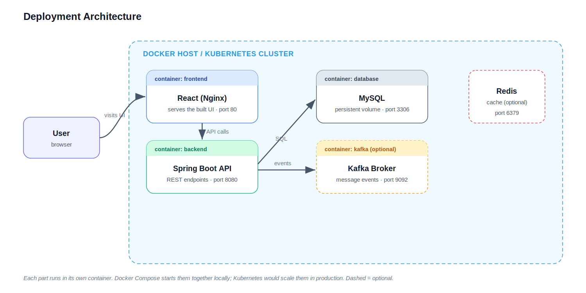

Each part runs in its own container: the React UI, the Spring Boot API, the database, and (optionally) Kafka and Redis. **Docker Compose** starts them together on one machine; **Kubernetes** would run and scale them in production. Locally, you can also run the backend and frontend directly without containers.

---

## 🔮 Future Improvements

- 💸 **UPI integration** — instant phone/UPI-ID based payments alongside RTGS and NEFT
- 🔄 **Full Kafka event-driven processing** — move notifications and settlement onto event streams
- 🧩 **Microservices architecture** — split auth, accounts, and payments into independent services
- ☁️ **Cloud deployment** — containerised deployment with managed databases and auto-scaling
- 🤖 **AI-based fraud detection** — replace fixed-threshold rules with a risk-scoring model

---

## 📌 Notes

- This project demonstrates production-style patterns: layered architecture, JWT security, ACID transactions, idempotency, and audit logging.
- All diagrams are custom-built for this project and reflect its actual frontend and backend code.

---

<div align="center">

**Built with Java, Spring Boot, React, and MySQL**

⭐ If you find this project useful, consider giving it a star!

</div>
